# Astronomical Object Classification Project

## Overview
This project focuses on classifying astronomical objects into three categories: **Stars, Galaxies, and Quasars (QSO)**. We utilized multiple machine learning models, including **SVM, KNN, Logistic Regression, Decision Tree, and Random Forest**, to develop an effective classification model.

The goal was to leverage available features to build a robust and accurate classifier that generalizes well across different datasets.

---

## Dataset
The dataset consists of **10,000 observations** with **17 feature columns** and **one class column**. The primary attributes used for classification include:

- **Photometric features:** u, g, r, i, z (different wavelength magnitudes)
- **Spectroscopic features:** redshift
- **Other metadata features:** camcol, field, plate, specobjid, mjd, fiberid, rerun, objid

A thorough **Exploratory Data Analysis (EDA)** was conducted to understand feature distributions and correlations.

---

## Data Preprocessing

### **1. Checking for Missing Values**
- No missing values were found in the dataset.

### **2. Feature Selection**
- The features `objid` and `rerun` contained only a single unique value and were removed as they did not contribute to the classification.
- `specobjid` and `plate` were found to be highly correlated (`corr = 1.0`), leading to the removal of `specobjid`.

### **3. Checking for Duplicate Values**
- No duplicate records were found.

### **4. Feature Scaling**
- Standardization was applied where necessary to normalize the feature distributions.

### **5. Class Distribution**
- The dataset exhibited class imbalance:
   - **Galaxy:** 5000 samples
   - **Star:** 4150 samples
   - **QSO:** 850 samples (underrepresented class)

To mitigate this, we considered class-weighted approaches and feature selection.

---

## Exploratory Data Analysis (EDA)

### **Feature Distributions**

#### **Histogram - Distribution of Numerical Features:**

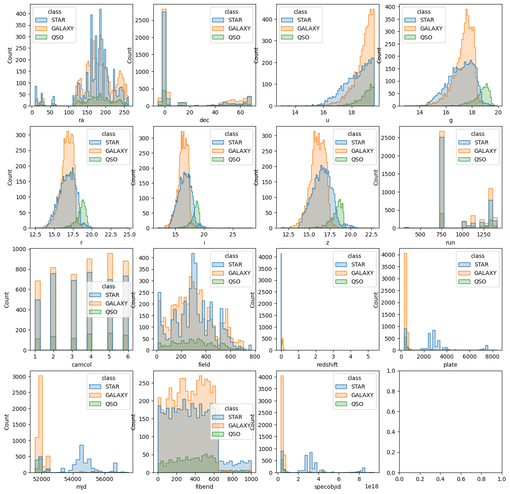

#### **Density Plot - Density Distribution of Features:**

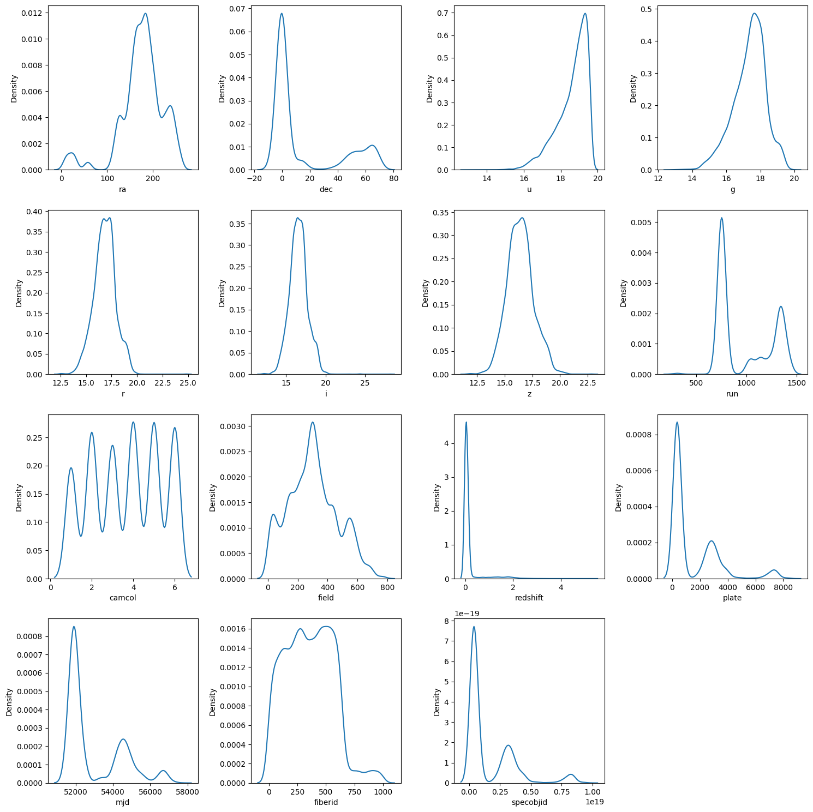

Most numerical variables (g, r, i, z) exhibit a normal-like distribution, while `u` is left-skewed.

#### **Box plots - Dispersion Across Features:**

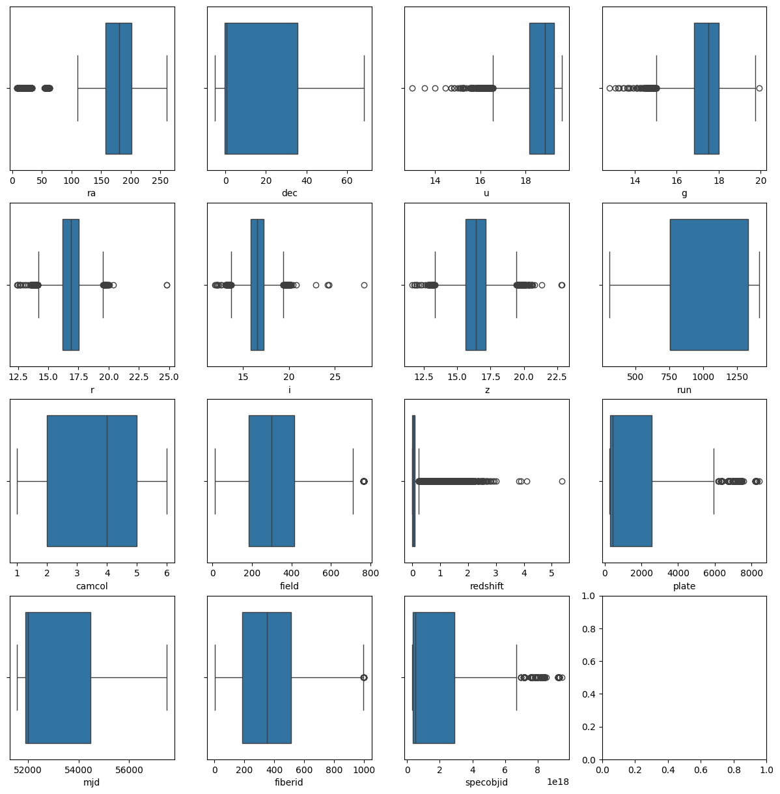

#### **Heatmap - Feature Correlation Analysis:**

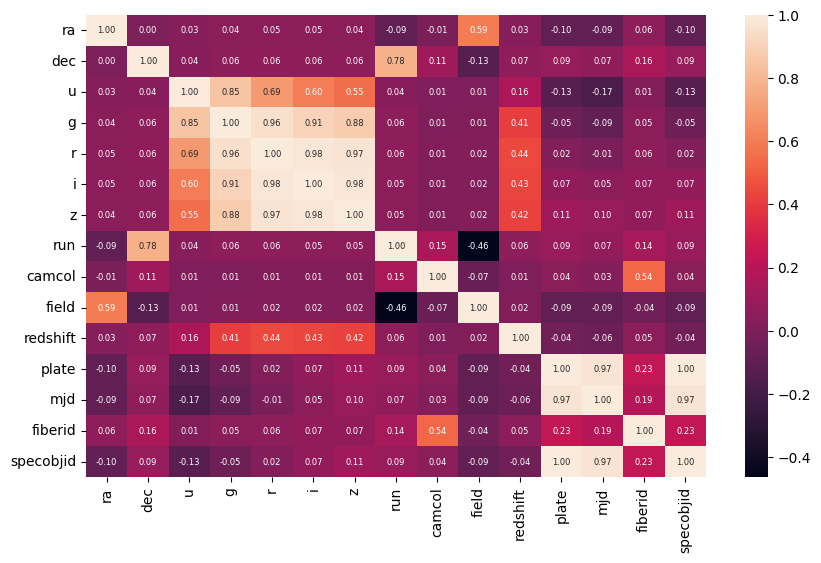

- Strong positive correlations were observed among `u, g, r, i, z`, indicating redundant information.
- `specobjid` and `plate` showed complete correlation (`1.0`), so `specobjid` was removed.

#### **Scatter Plots - Pairwise Feature Relationships:**

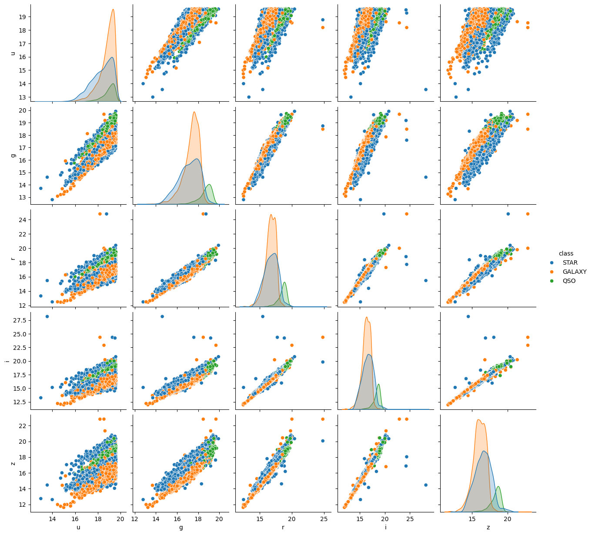

---

## Prepare Data

### **1. Convert **
- No missing values were found in the dataset.

### **2. Feature Selection**
- The features `objid` and `rerun` contained only a single unique value and were removed as they did not contribute to the classification.
- `specobjid` and `plate` were found to be highly correlated (`corr = 1.0`), leading to the removal of `specobjid`.

### **3. Checking for Duplicate Values**
- No duplicate records were found.

### **4. Feature Scaling**
- Standardization was applied where necessary to normalize the feature distributions.

### **5. Class Distribution**
- The dataset exhibited class imbalance:
   - **Galaxy:** 5000 samples
   - **Star:** 4150 samples
   - **QSO:** 850 samples (underrepresented class)

To mitigate this, we considered class-weighted approaches and feature selection.

---
---

## Model Evaluation

### **Baseline Model Performance (before PCA)**

| Model | Train Accuracy | Validation Accuracy | Test Accuracy |
|--------|----------------|--------------------|--------------|
| **SVM** | 98.81% | 99.00% | 98.55% |
| **KNN(k=3)** | 95.25% | 91.00% | 90.85% |
| **KNN(k=7)** | 92.93% | 90.06% | 90.55% |
| **Logistic Regression** | 98.45% | 98.43% | 98.45% |
| **Decision Tree** | 99.12% | 99.12% | 98.55% |
| **Random Forest** | 99.89% | 99.00% | 98.75% |

### **Baseline Model Performance (after PCA)**

**PCA Result:** 9 principal components were selected (reduces the feature space from 14 to 9), capturing 98.69% of the total variance 

| Model | Train Accuracy | Validation Accuracy | Test Accuracy |
|--------|----------------|--------------------|--------------|
| **SVM** | 98.34% | 98.56% | 98.15% |
| **KNN(k=3)** | 94.31% | 89.25% | 89.35% |
| **Logistic Regression** | 98.09% | 98.18% | 98.00% |
| **Decision Tree** | 93.07% | 88.75% | 88.65% |
| **Random Forest** | 99.64% | 91.81% | 91.40% |

#### **Model Performance Comparison Plot:**
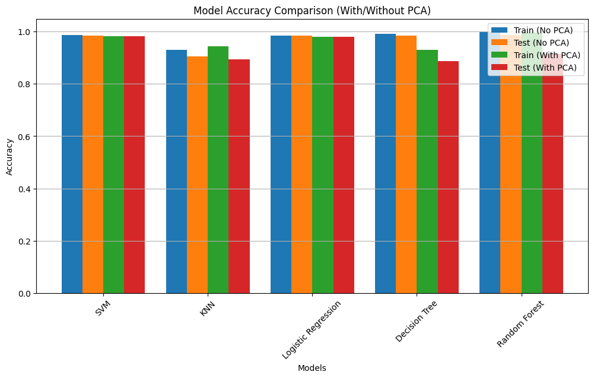

### **Best Model Without PCA & Minimal Overfitting: Desicion Tree**
- **Train Accuracy:** 99.12%
- **Validation Accuracy:** 99.12%
- **Test Accuracy:** 98.55%

Random Forest achieved high accuracy while maintaining strong generalization. However, it exhibited slight overfitting.
Therefore, we prefer to use a decision tree (Full explanation in the file - Astronomical_Object_Classification_Report.pdf)

#### **Decision Tree - Important Features:**
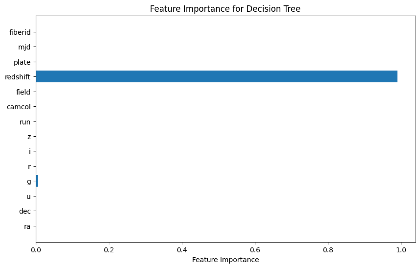

### **Best Model With PCA: SVM**
- **Train Accuracy:** 98.34%
- **Validation Accuracy:** 98.56%
- **Test Accuracy:** 98.15%

After applying PCA, reducing the feature space from **14 to 9 dimensions**, **SVM** maintained high classification performance while improving computational efficiency.

#### **SVM - Important Features (before PCA):**

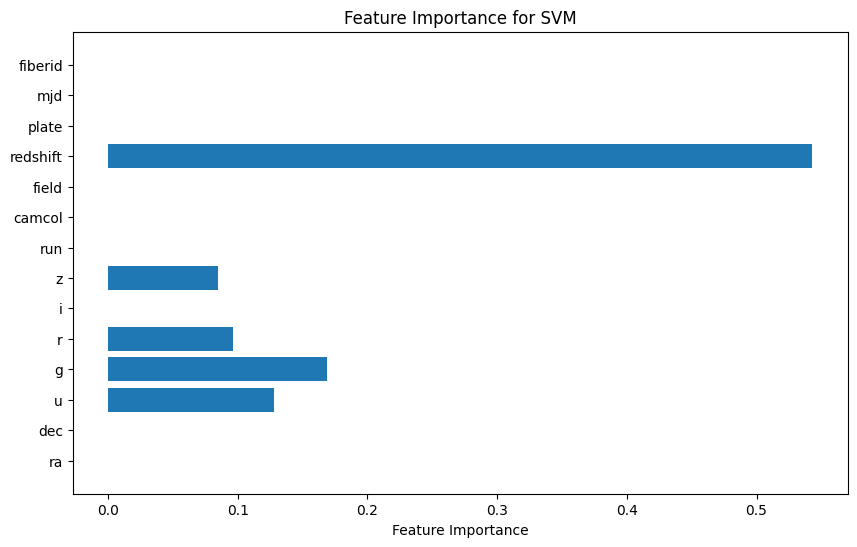

#### **SVM - Important eigenvectors (after PCA):**
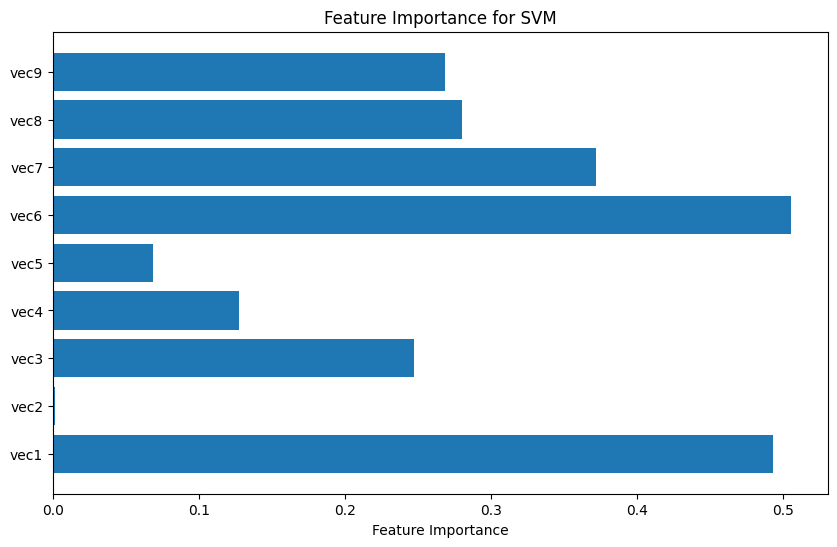
---

## Feature Reduction & Model Retraining

After analyzing feature importance, we removed less relevant features(reduces the feature space from 14 to 6):
- **Removed Features:** `fiberid`, `camcol`, `field`, `run`, `ra`, `plate`, `mjd`, `dec`
- **Remaining Features:** `u, g, r, i, z, redshift`

(Full explanation in the file - Astronomical_Object_Classification_Report.pdf)

### **Model Performance After Feature Reduction (before PCA)**

| Model | Train Accuracy | Validation Accuracy | Test Accuracy |
|--------|----------------|--------------------|--------------|
| **SVM** | 98.75% | 99.00% | 98.45% |
| **KNN(k=3)** | 97.65% | 96.18% | 96.00% |
| **Logistic Regression** | 98.10% | 97.93% | 98.30% |
| **Decision Tree** | 99.68% | 98.81% | 98.50% |
| **Random Forest** | 99.29% | 99.06% | 98.70% |

### **Model Performance After Feature Reduction (after PCA)**

**PCA Result:** 3 principal components were selected (reduces the feature space from 6 to 3), capturing 99.40% of the total variance 

| Model | Train Accuracy | Validation Accuracy | Test Accuracy |
|--------|----------------|--------------------|--------------|
| **SVM** | 98.18% | 98.56% | 98.00% |
| **KNN(k=3)** | 97.03% | 95.43% | 95.40% |
| **Logistic Regression** | 98.10% | 98.18% | 97.80% |
| **Decision Tree** | 98.51% | 92.06% | 92.70% |
| **Random Forest** | 100% | 93.25% | 94.25% |

#### **Model Performance Comparison Plot:**
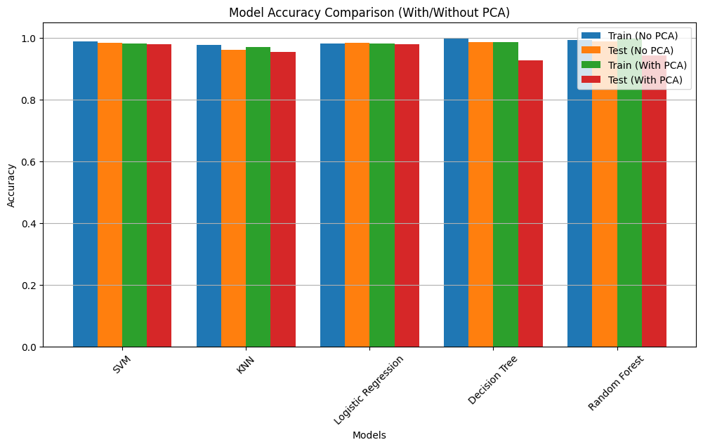

### **Best Model Without PCA & Minimal Overfitting: Random Forest**
- **Train Accuracy:** 99.29%
- **Validation Accuracy:** 99.06%
- **Test Accuracy:** 98.70%

Decision tree achieved high accuracy while maintaining strong generalization. However, it exhibited slight overfitting.
Therefore, we prefer to use a random Forest (Full explanation in the file - Astronomical_Object_Classification_Report.pdf)

#### **Random Forest - Important Features:**
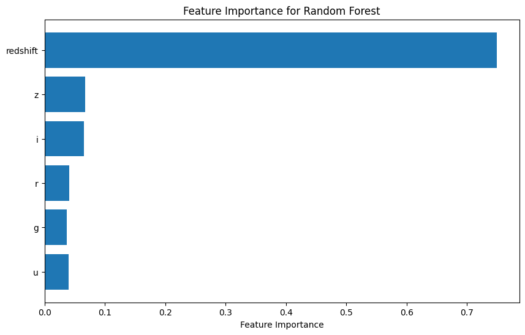

### **Best Model With PCA & Minimal Overfitting:: SVM**
- **Train Accuracy:** 98.18%
- **Validation Accuracy:** 98.56%
- **Test Accuracy:** 98.00%

After applying PCA, reducing the feature space from **6 to 3 dimensions**, **SVM** maintained high classification performance while improving computational efficiency.

#### **SVM - Important Features (before PCA):**

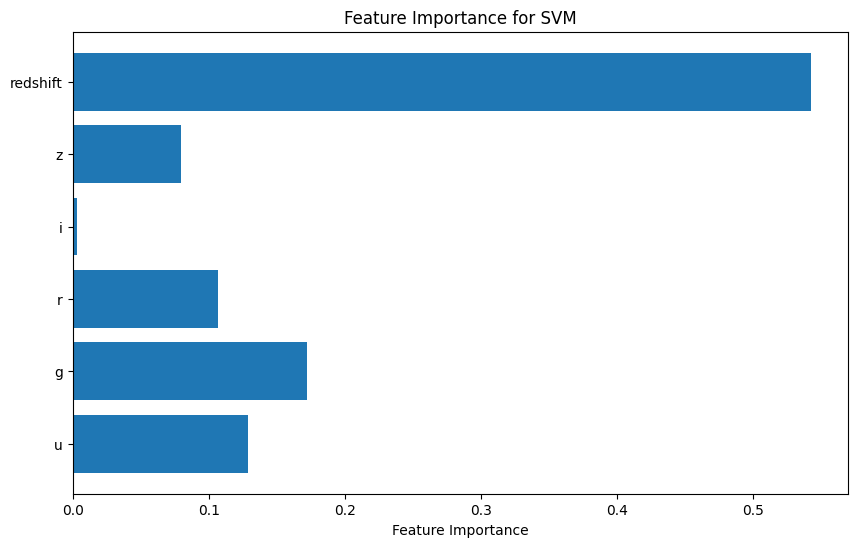

#### **SVM - Important eigenvectors (after PCA):**
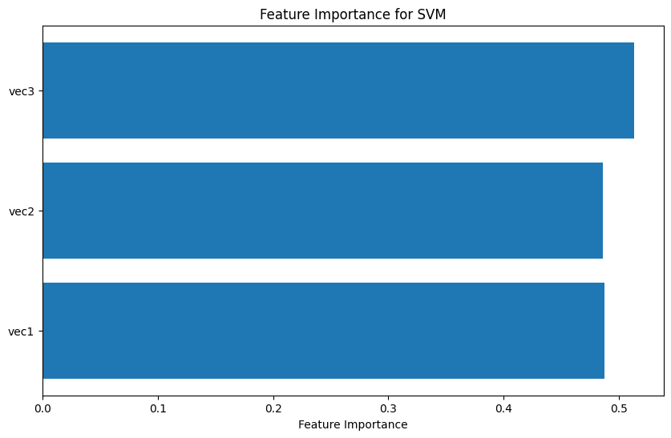
---

## Key Insights

1. **Random Forest without PCA (6 features)** the best model with high accuracy and minimal overfitting, With a minimal amount of features.
2. **SVM with PCA (3 features)** provided an optimal balance between dimensionality reduction and classification accuracy With a minimal amount of features.
3. **Reducing features improved model stability:**
   - **Random Forest (6 features)** classified **QSO objects with a precision of 0.95**.
   - **SVM with PCA (3 features)** achieved **0.95 precision for QSO** with fewer dimensions.
4. **Handling Class Imbalance:**
   - QSO (Quasars) were underrepresented, leading to lower recall.
   - After feature reduction, **Random Forest & SVM** improved QSO classification consistency.
5. **Improving computational efficiency:**
   - Removing unimportant features - reducing the feature space from **17 to 6 dimensions**.
   - Applying PCA - reducing the feature space from **6 to 3 dimensions**.
   Therefore, we were able to reduce feature space from **17 to 3 dimensions**.

---

## Conclusion
Through **feature selection, PCA, and careful model tuning**, we achieved a highly accurate classification of astronomical objects. **Random Forest (6 features, no PCA)** remained the most effective model, while **SVM with PCA (3 features)** provided the best trade-off between accuracy and efficiency.

By overcoming challenges related to **overfitting and class imbalance**, we successfully built a model capable of **accurately classifying stars, galaxies, and quasars** with minimal computational complexity.

---

## How to Run
1. Clone the repository:
   ```bash
   git clone https://github.com/2shlomi9/Astronomical-Object-Classification.git
   ```
2. Install dependencies:
   ```bash
   pip install -r requirements.txt
   ```
3. Run:
   ```bash
   python main.py
   ```
---

## Attachments:

#### **Astronomical_Object_Classification_Report.pdf:** 
A detailed report summarizing the entire project, including data analysis, model evaluation, feature selection, and results. 
It provides insights into the classification of astronomical objects and the performance of different machine learning models. 

#### **Dataset/Skyserver.csv:** 
The dataset - Sloan Digital Sky Survey DR14
Link - https://www.kaggle.com/datasets/lucidlenn/sloan-digital-sky-survey

#### **utils.py:** 
Contains helper functions, primarily for preprocessing, PCA, and other essential data transformations.

#### **models.py:**  
Includes all functions related to the five machine learning models used in this project. 

#### **visualizations.py:**  
Contains all functions for generating and displaying visual outputs.

#### **main.py:** 
The main execution file. Simply run this script, and it will execute all steps in an organized manner.

#### **requirements.txt:** 
This file contains all the dependencies required to run the project.

#### **Notebook/astronomical-object-classification.ipynb:** 
An IPython Notebook (.ipynb) is provided, allowing for easy visualization of all outputs without the need to run 
the code manually. 
---

